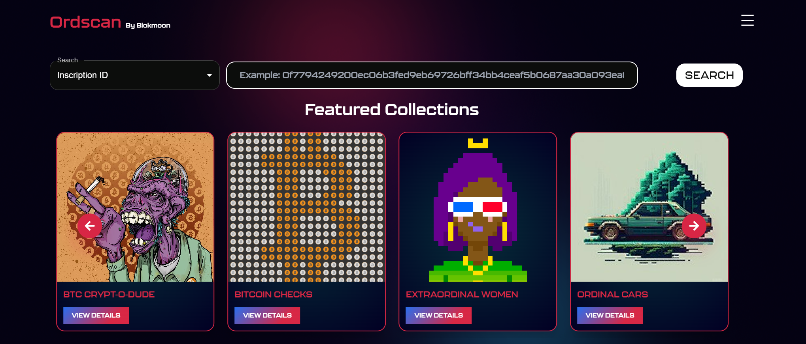

# Ordscan FOSS

> [!NOTE]
> This repository was archived on 14 August 2026. It is preserved as a historical record and is not maintained or deployed.

Ordscan FOSS was a public Bitcoin Ordinals explorer and early marketplace frontend built in March 2023. It explored inscription search, collection discovery, order-book views, wallet connections, and PSBT-based listing and purchase flows.

## Why this repository is archived

This code overlaps with the larger OrdinalNovus marketplace codebase, which is the canonical successor being prepared separately for a clean open-source release. Maintaining two similar products would split effort and make the project history harder to understand.

The recorded Ordscan deployment has been retired. This repository also depends on historical external APIs, wallet integrations, and packages that may no longer work as originally implemented.

## Historical stack

- Next.js 13, React 18, and TypeScript
- Tailwind CSS and Material UI
- BitcoinJS, PSBT transaction flows, and Bitcoin wallet integrations
- Ordinals explorer, collection, order-book, and inscription-provider APIs
- Vercel Analytics and Mixpanel integration

## Important limitations

- Do not use this application to sign, broadcast, buy, or sell with real funds.
- The code has not been updated for current wallet, API, dependency, or security expectations.
- External data providers and backend services may be unavailable.
- No live deployment or support is provided.

The source and commit history remain public to document the project's development and the path toward OrdinalNovus.

## License

Licensed under the [MIT License](LICENSE).
